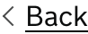
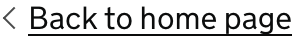

<!-- Generated from src/GovUk.Frontend.AspNetCore.Docs/Templates/components/back-link.liquid -->
# Back link

[GOV.UK Design System back link component](https://design-system.service.gov.uk/components/back-link/)


## Tag helpers

### Example with default content


```razor
<govuk-back-link href="/" />
```


### Example with custom content


```razor
<govuk-back-link href="/">Back to home page</govuk-back-link>
```


### Example with generated href


```razor
<govuk-back-link asp-controller="Home" asp-action="Index" />
```


### API

#### `<govuk-back-link>`

The content is the HTML to use within the back link. The default is 'Back'.

| Attribute | Type | Description |
| --- | --- | --- |
| (link attributes) |  | See [documentation on links](../links.md) for more information. |

