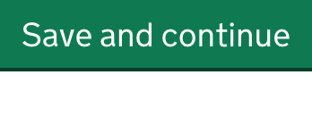
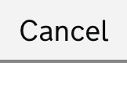
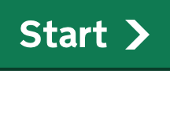
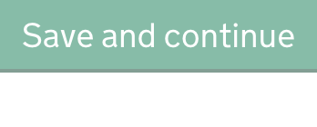
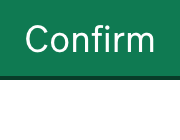

<!-- Generated from src/GovUk.Frontend.AspNetCore.Docs/Templates/components/button.liquid -->
# Button

[GOV.UK Design System button component](https://design-system.service.gov.uk/components/button/)


## Tag helpers

There are two tag helpers for the button component. `<govuk-button>` generates a `<button>` element; `<govuk-button-link>` generates an `<a>` element.

### Default button


```razor
<govuk-button type="submit">Save and continue</govuk-button>
```


### Secondary button


```razor
<govuk-button class="govuk-button--secondary">Cancel</govuk-button>
```


### Start button


```razor
<govuk-button-link is-start-button="true" href="/start">Start</govuk-button-link>
```


### Disabled button


```razor
<govuk-button disabled="true">Save and continue</govuk-button>
```


### Link


```razor
<govuk-button-link href="/">Confirm</govuk-button-link>
```


### Generated link


```razor
<govuk-button-link asp-controller="Home" asp-action="Confirm">Confirm</govuk-button-link>
```


### Generated form action


```razor
<govuk-button type="submit" asp-controller="Home" asp-action="Confirm">Confirm</govuk-button>
```


### API

#### `<govuk-button>`

The content is the HTML to use within the button.

| Attribute | Type | Description |
| --- | --- | --- |
| `disabled` | `bool?` | Whether the button should be disabled. |
| `id` | `string` | The `id` attribute for the generated `button` element. |
| `is-start-button` | `bool?` | Whether this button is the main call to action on your service's start page. |
| `name` | `string` | The `name` attribute for the generated `button` element. |
| `prevent-double-click` | `bool?` | Whether to prevent accidental double clicks on submit buttons from submitting forms multiple times. The default is set for the application in `DefaultButtonPreventDoubleClick`. |
| `type` | `string` | The `type` attribute for the generated `button` element. |
| `value` | `string` | The `value` attribute for the generated `button` element. |
| (link attributes) |  | See [documentation on links](../links.md) for more information. |


#### `<govuk-button-link>`

The content is the HTML to use within the button link.

| Attribute | Type | Description |
| --- | --- | --- |
| `id` | `string` | The `id` attribute for the generated `button` element.. |
| `is-start-button` | `bool?` | Whether this button is the main call to action on your service's start page. |
| (link attributes) |  | See [documentation on links](../links.md) for more information. |

