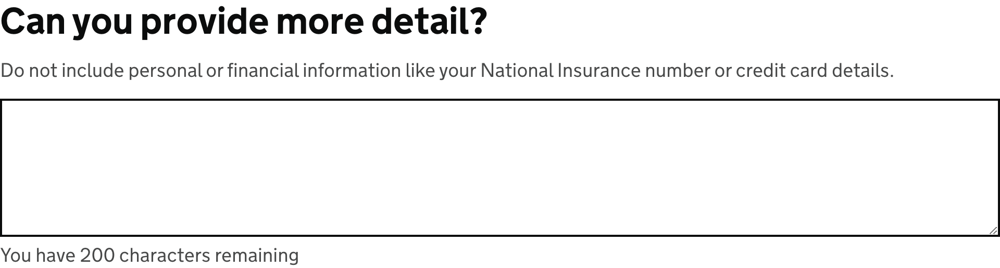

<!-- Generated from src/GovUk.Frontend.AspNetCore.Docs/Templates/components/character-count.liquid -->
# Character count

[GOV.UK Design System character count component](https://design-system.service.gov.uk/components/character-count/)

Check out the [max words validator](../validation/maxwords.md) for adding server-side validation when `max-words` is used.


## Tag helpers

### Example


```razor
<govuk-character-count for="MoreDetail" max-length="200">
    <label class="govuk-label--l" is-page-heading="true">
        Can you provide more detail?
    </label>
    <hint>
        Do not include personal or financial information like your National Insurance number or credit card details.
    </hint>
</govuk-character-count>
```


### API

#### `<govuk-character-count>`

| Attribute | Type | Description |
| --- | --- | --- |
| `autocomplete` | `string` | The `autocomplete` attribute for the generated `textarea` element. |
| `count-message-*` |  | Additional attributes to add to the generated count message hint element. |
| `disabled` | `bool?` | Whether the `disabled` attribute should be added to the generated `textarea` element. |
| `for` | `Microsoft.AspNetCore.Mvc.ViewFeatures.ModelExpression` | An expression to be evaluated against the current model. |
| `form-group-*` |  | Additional attributes to add to the generated form-group wrapper element. |
| `id` | `string` | The `id` attribute for the generated `textarea` element. If not specified then a value is generated from the `name` attribute. |
| `ignore-modelstate-errors` | `bool?` | Whether the `Errors` for the `For` expression should be used to deduce an error message. When there are multiple errors in the `ModelErrorCollection` the first is used. |
| `label-class` | `string` | Additional classes for the generated `label` element. |
| `max-length` | `int?` | The maximum number of characters the generated `textarea` may contain. Required unless `MaxWords` is specified. |
| `max-words` | `int?` | The maximum number of words the generated `textarea` may contain. Required unless `MaxLength` is specified. |
| `name` | `string` | The `name` attribute for the generated `textarea` element. Required unless `For` is specified. |
| `readonly` | `bool?` | Whether the `readonly` attribute should be added to the generated `textarea` element. |
| `rows` | `int?` | The `rows` attribute for the generated `textarea` element. The default is `5`. |
| `spellcheck` | `bool?` | The `spellcheck` attribute for the generated `textarea` element. |
| `textarea-*` |  | Additional attributes to add to the generated `textarea` element. |
| `threshold` | `decimal?` | The percentage value of the limit at which point the count message is displayed. If this is specified the count message will be hidden by default. |


#### `<label>` / `<govuk-character-count-label>`

The content is the HTML to use within the component's label.

Must be inside a `<govuk-character-count>` element.

| Attribute | Type | Description |
| --- | --- | --- |
| `is-page-heading` | `bool?` | Whether the label also acts as the heading for the page. |


#### `<hint>` / `<govuk-character-count-hint>`

The content is the HTML to use within the component's hint.

Must be inside a `<govuk-character-count>` element.


#### `<error-message>` / `<govuk-character-count-error-message>`

The content is the HTML to use within the component's error message.

Must be inside a `<govuk-character-count>` element.

| Attribute | Type | Description |
| --- | --- | --- |
| `visually-hidden-text` | `string` | A visually hidden prefix used before the error message. The default is `"Error"`. |


#### `<before-input>` / `<govuk-character-count-before-input>`

The content is the HTML to use before the generated textarea element.

Must be inside a `<govuk-character-count>` element.


#### `<value>` / `<govuk-character-count-value>`

The content is the HTML to use within the generated textarea.

Must be inside a `<govuk-character-count>` element.


#### `<after-input>` / `<govuk-character-count-after-input>`

The content is the HTML to use after the generated textarea element.

Must be inside a `<govuk-character-count>` element.

