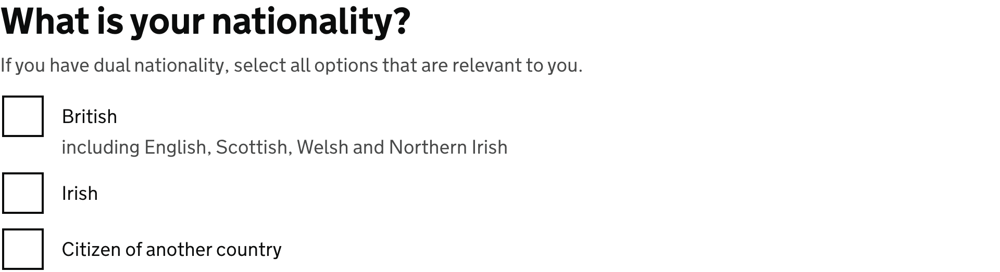
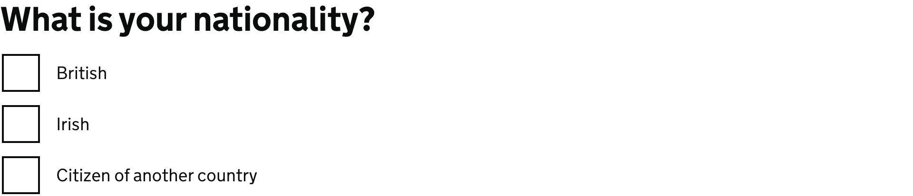
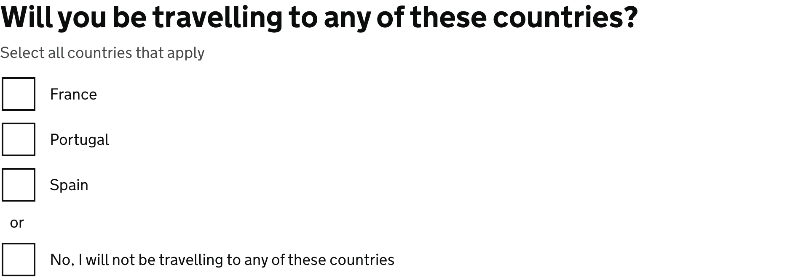
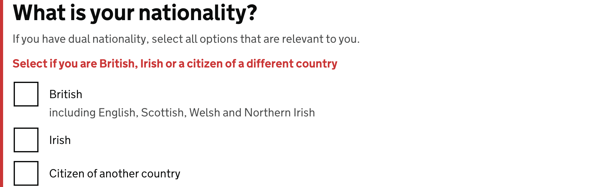

<!-- Generated from src/GovUk.Frontend.AspNetCore.Docs/Templates/components/checkboxes.liquid -->
# Checkboxes

[GOV.UK Design System checkboxes component](https://design-system.service.gov.uk/components/checkboxes/)


## Tag helpers

### Example


```razor
<govuk-checkboxes for="Nationalities">
    <legend is-page-heading="true" class="govuk-fieldset__legend--l">
        What is your nationality?
    </legend>

    <hint>
        If you have dual nationality, select all options that are relevant to you.
    </hint>

    <item value="british">
        British
        <hint>including English, Scottish, Welsh and Northern Irish</hint>
    </item>
    <item value="irish">Irish</item>
    <item value="other">Citizen of another country</item>
</govuk-checkboxes>
```


### Example with a fieldset generated from the model metadata


```razor
<govuk-checkboxes for="Nationalities" fieldset legend-class="govuk-fieldset__legend--l" legend-is-page-heading="true">
    <item value="british">British</item>
    <item value="irish">Irish</item>
    <item value="other">Citizen of another country</item>
</govuk-checkboxes>
```


### Example without fieldset


```razor
<govuk-checkboxes for="AcceptedTermsAndConditions">
    <item value="true">
        I agree to the terms and conditions
    </item>
</govuk-checkboxes>
```


### Example with conditional reveal


```razor
<govuk-checkboxes for="ContactPreferences">
    <legend is-page-heading="true" class="govuk-fieldset__legend--l">
        How would you like to be contacted?
    </legend>

    <hint>
        Select all options that are relevant to you.
    </hint>

    <item value="email">
        Email
        <conditional>
            <govuk-input for="EmailAddress" type="email" autocomplete="email" spellcheck="false" input-class="govuk-!-width-one-third">
                <label>Email address</label>
            </govuk-input>
        </conditional>
    </item>

    <item value="phone">
        Phone
        <conditional>
            <govuk-input for="PhoneNumber" type="tel" autocomplete="tel" input-class="govuk-!-width-one-third">
                <label>Phone number</label>
            </govuk-input>
        </conditional>
    </item>

    <item value="text message">
        Text message
        <conditional>
            <govuk-input for="MobilePhoneNumber" type="tel" autocomplete="tel" input-class="govuk-!-width-one-third">
                <label>Mobile phone number</label>
            </govuk-input>
        </conditional>
    </item>
</govuk-checkboxes>
```


### Example with 'none' option


```razor
<govuk-checkboxes for="CountriesTravellingTo">
    <legend is-page-heading="true" class="govuk-fieldset__legend--l">
        Will you be travelling to any of these countries?
    </legend>

    <hint>
        Select all countries that apply
    </hint>

    <item value="france">France</item>
    <item value="portugal">Portugal</item>
    <item value="spain">Spain</item>
    <divider>or</divider>
    <item value="none" behavior="CheckboxesItemBehavior.Exclusive">No, I will not be travelling to any of these countries</item>
</govuk-checkboxes>
```


### Example with error message


```razor
<govuk-checkboxes name="nationality">
    <legend is-page-heading="true" class="govuk-fieldset__legend--l">
        What is your nationality?
    </legend>

    <hint>
        If you have dual nationality, select all options that are relevant to you.
    </hint>

    <error-message>
        Select if you are British, Irish or a citizen of a different country
    </error-message>

    <item value="british">
        British
        <hint>including English, Scottish, Welsh and Northern Irish</hint>
    </item>
    <item value="irish">Irish</item>
    <item value="other">Citizen of another country</item>
</govuk-checkboxes>
```


### API

#### `<govuk-checkboxes>`

| Attribute | Type | Description |
| --- | --- | --- |
| `checkboxes-*` |  | Additional attributes for the container element that wraps the items. |
| `described-by` | `string` | One or more element IDs to add to the `aria-describedby` attribute of the generated elements. |
| `fieldset` | `bool` | Whether a `fieldset` should be generated to wrap the component. A `fieldset` is generated automatically when a `govuk-checkboxes-fieldset` element or a `govuk-checkboxes-fieldset-legend` element is used, or when any `fieldset-*`, `legend-*` or `legend-is-page-heading` attribute is specified; this attribute is only required when a `fieldset` is wanted but none of those are used.  The legend's content is deduced from the `For` expression's metadata. |
| `fieldset-*` |  | Additional attributes for the generated `fieldset` element. |
| `for` | `Microsoft.AspNetCore.Mvc.ViewFeatures.ModelExpression` | An expression to be evaluated against the current model. |
| `id-prefix` | `string` | The prefix to use when generating IDs for the hint, error message and items. Required unless `For` or `Name` is specified. |
| `ignore-modelstate-errors` | `bool?` | Whether the `Errors` for the `For` expression should be used to deduce an error message. |
| `legend-*` |  | Additional attributes for the generated `fieldset`'s `legend` element. These are combined with any attributes specified on a `govuk-checkboxes-fieldset-legend` element; where both specify the same attribute the one on the element wins, except for `class`, where the two values are combined. |
| `legend-is-page-heading` | `bool?` | Whether the generated `fieldset`'s `legend` also acts as the heading for the page. An `is-page-heading` attribute on a `govuk-checkboxes-fieldset-legend` element takes precedence over this. |
| `name` | `string` | The `name` attribute for the generated `input` elements. Required unless `For` or `IdPrefix` is specified. |


#### `<govuk-checkboxes-fieldset>`

A container element used when the checkboxes should be contained within a fieldset element. When used, every hint, error message, item and divider must be placed inside this element rather than the root checkboxes element, and each must use its govuk- prefixed name; the short names are only available directly inside the root checkboxes element.

Must be inside a `<govuk-checkboxes>` element.

| Attribute | Type | Description |
| --- | --- | --- |
| `described-by` | `string` | One or more element IDs to add to the `aria-describedby` attribute. |


#### `<legend>` / `<govuk-checkboxes-fieldset-legend>`

The content is the HTML to use within the legend. When this element is specified directly inside the root checkboxes element a fieldset is generated automatically.

Must be inside a `<govuk-checkboxes>` or `<govuk-checkboxes-fieldset>` element.

| Attribute | Type | Description |
| --- | --- | --- |
| `is-page-heading` | `bool?` | Whether the legend also acts as the heading for the page. The default is `false`. |


#### `<hint>` / `<govuk-checkboxes-hint>`

The content is the HTML to use within the component's hint.

Must be inside a `<govuk-checkboxes>` or `<govuk-checkboxes-fieldset>` element.


#### `<error-message>` / `<govuk-checkboxes-error-message>`

The content is the HTML to use within the component's error message.

Must be inside a `<govuk-checkboxes>` or `<govuk-checkboxes-fieldset>` element.

| Attribute | Type | Description |
| --- | --- | --- |
| `visually-hidden-text` | `string` | A visually hidden prefix used before the error message. The default is `"Error"`. |


#### `<before-inputs>` / `<govuk-checkboxes-before-inputs>`

The content is the HTML to use before the checkboxes.

Must be inside a `<govuk-checkboxes>` or `<govuk-checkboxes-fieldset>` element.


#### `<item>` / `<govuk-checkboxes-item>`

The content is the HTML to use within the label for the generated input element.

Must be inside a `<govuk-checkboxes>` or `<govuk-checkboxes-fieldset>` element.

| Attribute | Type | Description |
| --- | --- | --- |
| `checked` | `bool?` | Whether the item should be checked. If `null` and `For` is not `null` on the parent `CheckboxesTagHelper` then the value will be computed by comparing the specified model expression with `Value`. The default is `false`. |
| `disabled` | `bool?` | Whether the `disabled` attribute should be added to the generated `input` element. The default is `false`. |
| `id` | `string` | The `id` attribute for the generated `input` element. If not specified then a value is generated from the `name` attribute. |
| `input-*` |  | Additional attributes to add to the generated `input` element. |
| `label-*` |  | Additional attributes to add to the generated `label` element. |
| `name` | `string` | The `name` attribute for the generated `input` element. Required unless `For` or `Name` is specified on the parent `CheckboxesTagHelper`. |
| `value` | `string` | The `value` attribute for the item. |


#### `<hint>` / `<govuk-checkboxes-item-hint>`

The content is the HTML to use within the item's hint.

Must be inside an `<item>` or `<govuk-checkboxes-item>` element.


#### `<conditional>` / `<govuk-checkboxes-item-conditional>`

The content is the HTML to use within the conditional reveal for the item.

Must be inside an `<item>` or `<govuk-checkboxes-item>` element.


#### `<divider>` / `<govuk-checkboxes-divider>`

The content is the HTML to use within the item divider.

Must be inside a `<govuk-checkboxes>` or `<govuk-checkboxes-fieldset>` element.


#### `<after-inputs>` / `<govuk-checkboxes-after-inputs>`

The content is the HTML to use after the checkboxes.

Must be inside a `<govuk-checkboxes>` or `<govuk-checkboxes-fieldset>` element.

