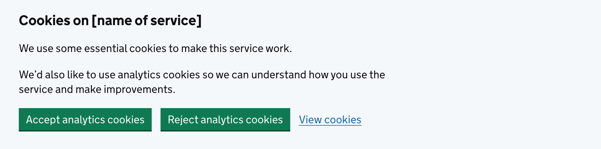

<!-- Generated from src/GovUk.Frontend.AspNetCore.Docs/Templates/components/cookie-banner.liquid -->
# Cookie banner

[GOV.UK Design System cookie banner component](https://design-system.service.gov.uk/components/cookie-banner/)


## Tag helpers

### Example


```razor
<govuk-cookie-banner aria-label="Cookie on [name of service]">
    <message>
        <heading>Cookies on [name of service]</heading>
        <content>
            <p class="govuk-body">We use some essential cookies to make this service work.</p>
            <p class="govuk-body">We’d also like to use analytics cookies so we can understand how you use the service and make improvements.</p>
        </content>
        <message-actions>
            <action-button text="Accept analytics cookies" type="button"/>
            <action-button text="Reject analytics cookies" type="button"/>
            <action-link text="View cookies" href="#"/>
        </message-actions>
    </message>
</govuk-cookie-banner>
```


### Example with long tag names


```razor
<govuk-cookie-banner aria-label="Cookie on [name of service]">
    <govuk-cookie-banner-message>
        <govuk-cookie-banner-message-heading>Cookies on [name of service]</govuk-cookie-banner-message-heading>
        <govuk-cookie-banner-message-content>
            <p class="govuk-body">We use some essential cookies to make this service work.</p>
            <p class="govuk-body">We’d also like to use analytics cookies so we can understand how you use the service and make improvements.</p>
        </govuk-cookie-banner-message-content>
        <govuk-cookie-banner-message-actions>
            <govuk-cookie-banner-message-action-button text="Accept analytics cookies" type="button"/>
            <govuk-cookie-banner-message-action-button text="Reject analytics cookies" type="button"/>
            <govuk-cookie-banner-message-action-link text="View cookies" href="#"/>
        </govuk-cookie-banner-message-actions>
    </govuk-cookie-banner-message>
</govuk-cookie-banner>
```


### API

#### `<govuk-cookie-banner>`

| Attribute | Type | Description |
| --- | --- | --- |
| `aria-label` | `string` | The text for the `aria-label` which labels the cookie banner region. |
| `hidden` | `bool?` | Whether the cookie banner should be hidden. If not specified, `false` is used. |


#### `<message>` / `<govuk-cookie-banner-message>`

Must be inside a `<govuk-cookie-banner>` element.

| Attribute | Type | Description |
| --- | --- | --- |
| `hidden` | `bool?` | Whether the message should be hidden. If not specified, `false` is used. |
| `role` | `string` | The `role` attribute for the message. Set role to `alert` on confirmation messages to allow assistive tech to automatically read the message. You will also need to move focus to the confirmation message using JavaScript you have written yourself. |


#### `<heading>` / `<govuk-cookie-banner-message-heading>`

Must be inside a `<message>` or `<govuk-cookie-banner-message>` element.


#### `<content>` / `<govuk-cookie-banner-message-content>`

Must be inside a `<message>` or `<govuk-cookie-banner-message>` element.


#### `<message-actions>` / `<govuk-cookie-banner-message-actions>`

Must be inside a `<message>` or `<govuk-cookie-banner-message>` element.


#### `<action-button>` / `<govuk-cookie-banner-message-action-button>`

> [!NOTE]
> This tag helper should not have any child content.

Must be inside a `<message-actions>` or `<govuk-cookie-banner-message-actions>` element.

| Attribute | Type | Description |
| --- | --- | --- |
| `name` | `string` | The `name` attribute for the generated `button` element. |
| `text` | `string` | The button text. This attribute is required. |
| `type` | `string` | The `type` attribute for the generated `button` element. |
| `value` | `string` | The `value` attribute for the generated `button` element. |
| (link attributes) |  | See [documentation on links](../links.md) for more information. |


#### `<action-link>` / `<govuk-cookie-banner-message-action-link>`

> [!NOTE]
> This tag helper should not have any child content.

Must be inside a `<message-actions>` or `<govuk-cookie-banner-message-actions>` element.

| Attribute | Type | Description |
| --- | --- | --- |
| `text` | `string` | The link text. This attribute is required. |
| (link attributes) |  | See [documentation on links](../links.md) for more information. |

