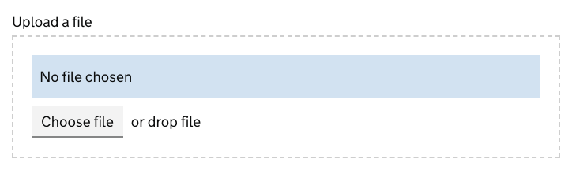

# File upload

[GDS File upload component](https://design-system.service.gov.uk/components/file-upload/)

## Example

```razor
<govuk-file-upload name="FileUpload1">
    <govuk-file-upload-label>Upload a file</govuk-file-upload-label>
</govuk-file-upload>
```


## Example - with error message

```razor
<govuk-file-upload name="FileUpload1">
    <govuk-file-upload-label>Upload a file</govuk-file-upload-label>
    <govuk-file-upload-error-message>The CSV must be smaller than 2MB</govuk-file-upload-error-message>
</govuk-file-upload>
```


## Example - with JavaScript enhancements

```razor
<govuk-file-upload name="FileUpload1" javascript="true">
     <govuk-file-upload-label>Upload a file</govuk-file-upload-label>
 </govuk-file-upload>
```




## API

### `<govuk-file-upload>`

| Attribute                  | Type              | Description                                                                                                                                                             |
|----------------------------|-------------------|-------------------------------------------------------------------------------------------------------------------------------------------------------------------------|
| `choose-files-button-text`        | `string`          | Text for the button that opens the file picker. Only applies when JavaScript enhancements are enabled.                                                                  |
| `described-by`                    | `string`          | One or more element IDs to add to the `aria-describedby` attribute of the generated `input` element.                                                                    |
| `disabled`                        | `bool`            | Whether the input should be disabled. The default is `false`.                                                                                                           |
| `drop-instruction-text`           | `string`          | Text instructing users to drop files in the drop zone. Only applies when JavaScript enhancements are enabled.                                                           |
| `entered-drop-zone-text`          | `string`          | Text announced to screen reader users when a user drags files into the drop zone. Only applies when JavaScript enhancements are enabled.                                |
| `for`                             | `ModelExpression` | The model expression used to generate the `name` and `id` attributes as well as the error message content. See [documentation on forms](forms.md) for more information. |
| `id`                              | `string`          | The `id` attribute for the generated `input` element. If not specified then a value is generated from the `name` attribute.                                             |
| `ignore-modelstate-errors`        | `bool`            | Whether ModelState errors on the ModelExpression specified by the `for` attribute should be ignored when generating an error message. The default is `false`.           |
| `input-*`                         |                   | Additional attributes to add to the generated `input` element.                                                                                                          |
| `javascript-enhancements`         | `bool?`           | Whether to enable JavaScript enhancements for the component.                                                                                                            |
| `label-class`                     | `string`          | Additional classes for the generated `label` element.                                                                                                                   |
| `left-drop-zone-text`             | `string`          | Text announced to screen reader users when a user drags files out of the drop zone. Only applies when JavaScript enhancements are enabled.                              |
| `multiple`                        | `bool?`           | The `multiple` attribute for the generated `input` element.                                                                                                             |
| `multiple-files-chosen-text-one`  | `string`          | Text shown when exactly one file has been chosen. Only applies when `multiple` is `true` and JavaScript enhancements are enabled.                                       |
| `multiple-files-chosen-text-other`| `string`          | Text shown when more than one file has been chosen. Only applies when `multiple` is `true` and JavaScript enhancements are enabled.                                     |
| `name`                            | `string`          | The `name` attribute for the generated `input` element. Required unless the `for` attribute is specified.                                                               |
| `no-file-chosen-text`             | `string`          | Text shown when no file has been chosen. Only applies when JavaScript enhancements are enabled.                                                                         |
| `wrapper-*`                       |                   | Additional attributes to add to the Javascript enhanced component's wrapper element.                                                                                    |

### `<govuk-file-upload-label>`

The content is the HTML to use within the component's label.\
Must be inside a `<govuk-file-upload>` element.

| Attribute          | Type   | Description                                                                      |
|--------------------|--------|----------------------------------------------------------------------------------|
| `is-page-heading`  | `bool` | Whether the label also acts as the heading for the page. The default is `false`. |

### `<govuk-file-upload-hint>`

The content is the HTML to use within the component's hint.\
Must be inside a `<govuk-file-upload>` element.

If the `for` attribute is specified on the parent `<govuk-file-upload>` then content for the hint will be generated from the model expression.\
If you want to retain the generated content and specify additional attributes then use a self-closing tag e.g.
`<govuk-file-upload-hint class="some-additional-class" />`.

### `<govuk-file-upload-error-message>`

The content is the HTML to use within the component's error message.\
Must be inside a `<govuk-file-upload>` element.

If the `for` attribute is specified on the parent `<govuk-file-upload>` then content for the error message will be generated from the model expression.
(To prevent this set `ignore-modelstate-errors` on the parent `<govuk-file-upload>` to `false`.) Specifying any content here will override any generated error message.\
If you want to retain the generated content and specify additional attributes then use a self-closing tag e.g.
`<govuk-file-upload-error-message visually-hidden-text="Error" />`.

| Attribute              | Type     | Description                                                                       |
|------------------------|----------|-----------------------------------------------------------------------------------|
| `visually-hidden-text` | `string` | The visually hidden prefix used before the error message. The default is `Error`. |
