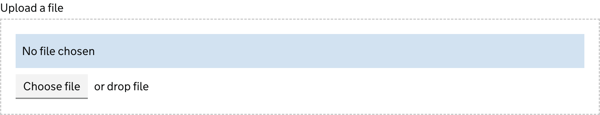

<!-- Generated from src/GovUk.Frontend.AspNetCore.Docs/Templates/components/file-upload.liquid -->
# File upload

[GOV.UK Design System file upload component](https://design-system.service.gov.uk/components/file-upload/)


## Tag helpers

### Example


```razor
<govuk-file-upload for="Document">
    <govuk-file-upload-label>Upload a file</govuk-file-upload-label>
</govuk-file-upload>
```


### Example with error message


```razor
<govuk-file-upload name="FileUpload1">
    <govuk-file-upload-label>Upload a file</govuk-file-upload-label>
    <govuk-file-upload-error-message>The CSV must be smaller than 2MB</govuk-file-upload-error-message>
</govuk-file-upload>
```


### Example with JavaScript enhancements


```razor
<govuk-file-upload for="Document" javascript-enhancements="true">
    <govuk-file-upload-label>Upload a file</govuk-file-upload-label>
</govuk-file-upload>
```


### API

#### `<govuk-file-upload>`

| Attribute | Type | Description |
| --- | --- | --- |
| `choose-files-button-text` | `string` | Text for the button that opens the file picker. |
| `described-by` | `string` | One or more element IDs to add to the `aria-describedby` attribute of the generated `input` element. |
| `disabled` | `bool?` | Whether the `disabled` attribute should be added to the generated `input` element. |
| `drop-instruction-text` | `string` | Text instructing users to drop files in the drop zone. |
| `entered-drop-zone-text` | `string` | Text announced when a user enters the drop zone while dragging files. |
| `for` | `Microsoft.AspNetCore.Mvc.ViewFeatures.ModelExpression` | An expression to be evaluated against the current model. |
| `id` | `string` | The `id` attribute for the generated `input` element. If not specified then a value is generated from the `name` attribute. |
| `ignore-modelstate-errors` | `bool?` | Whether the `Errors` for the `For` expression should be used to deduce an error message. When there are multiple errors in the `ModelErrorCollection` the first is used. |
| `input-*` |  | Additional attributes to add to the generated `input` element. |
| `javascript-enhancements` | `bool?` | Whether to enable JavaScript enhancements for the component. The default is set for the application in `DefaultFileUploadJavaScriptEnhancements`. |
| `label-class` | `string` | Additional classes for the generated `label` element. |
| `left-drop-zone-text` | `string` | Text announced when a user leaves the drop zone while dragging files. |
| `multiple` | `bool?` | The `multiple` attribute for the generated `input` element. |
| `multiple-files-chosen-text-one` | `string` | Text shown when exactly one file has been chosen (used when `Multiple` is `true`). |
| `multiple-files-chosen-text-other` | `string` | Text shown when more than one file has been chosen (used when `Multiple` is `true`). |
| `name` | `string` | The `name` attribute for the generated `input` element. Required unless `For` is specified. |
| `no-file-chosen-text` | `string` | Text shown when no file has been chosen. |
| `wrapper-*` |  | Additional attributes to add to the Javascript enhanced component's wrapper element. |


#### `<govuk-file-upload-label>`

The content is the HTML to use within the component's label.

Must be inside a `<govuk-file-upload>` element.

| Attribute | Type | Description |
| --- | --- | --- |
| `is-page-heading` | `bool?` | Whether the label also acts as the heading for the page. |


#### `<govuk-file-upload-hint>`

The content is the HTML to use within the component's hint.

Must be inside a `<govuk-file-upload>` element.


#### `<govuk-file-upload-error-message>`

The content is the HTML to use within the component's error message.

Must be inside a `<govuk-file-upload>` element.

| Attribute | Type | Description |
| --- | --- | --- |
| `visually-hidden-text` | `string` | A visually hidden prefix used before the error message. The default is `"Error"`. |


#### `<govuk-file-upload-before-input>`

The content is the HTML to use before the generated input element.

Must be inside a `<govuk-file-upload>` element.


#### `<govuk-file-upload-after-input>`

The content is the HTML to use after the generated input element.

Must be inside a `<govuk-file-upload>` element.

