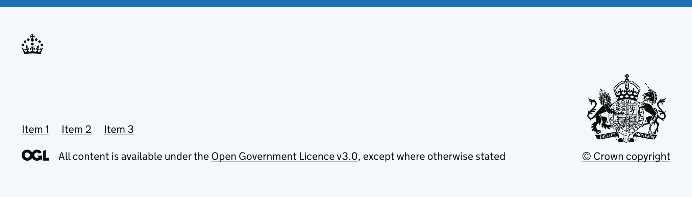
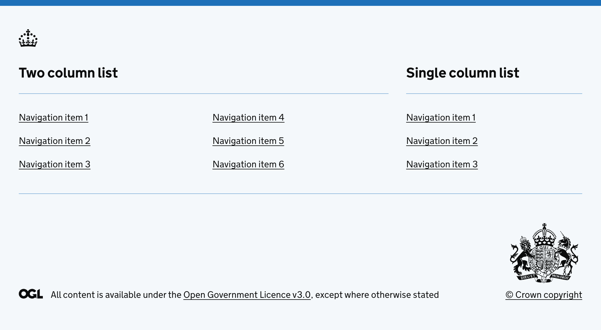
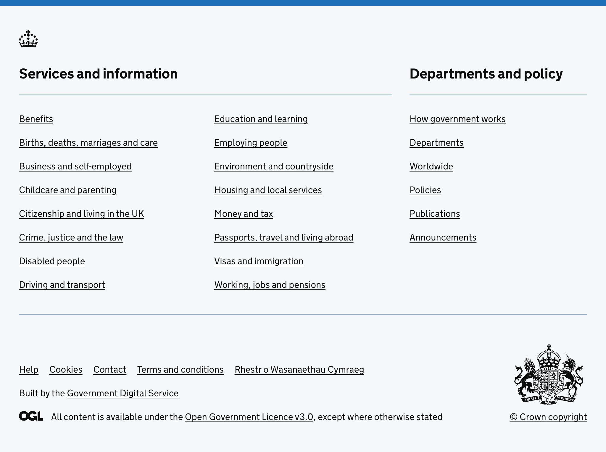

<!-- Generated from src/GovUk.Frontend.AspNetCore.Docs/Templates/components/footer.liquid -->
# GOV.UK footer

[GOV.UK Design System GOV.UK footer component](https://design-system.service.gov.uk/components/footer/)


### Example


```razor
<govuk-footer />
```




```razor
<govuk-footer>
    <govuk-footer-meta>
        <govuk-footer-meta-items>
            <govuk-footer-meta-item href="#">Item 1</govuk-footer-meta-item>
            <govuk-footer-meta-item href="#">Item 2</govuk-footer-meta-item>
            <govuk-footer-meta-item href="#">Item 3</govuk-footer-meta-item>
        </govuk-footer-meta-items>
    </govuk-footer-meta>
</govuk-footer>
```




```razor
<govuk-footer>
    <govuk-footer-nav width="two-thirds" columns="2">
        <govuk-footer-nav-title>Two column list</govuk-footer-nav-title>
        <govuk-footer-nav-items>
            <govuk-footer-nav-item href="#">Navigation item 1</govuk-footer-nav-item>
            <govuk-footer-nav-item href="#">Navigation item 2</govuk-footer-nav-item>
            <govuk-footer-nav-item href="#">Navigation item 3</govuk-footer-nav-item>
            <govuk-footer-nav-item href="#">Navigation item 4</govuk-footer-nav-item>
            <govuk-footer-nav-item href="#">Navigation item 5</govuk-footer-nav-item>
            <govuk-footer-nav-item href="#">Navigation item 6</govuk-footer-nav-item>
        </govuk-footer-nav-items>
    </govuk-footer-nav>
    <govuk-footer-nav width="one-third">
        <govuk-footer-nav-title>Single column list</govuk-footer-nav-title>
        <govuk-footer-nav-items>
            <govuk-footer-nav-item href="#">Navigation item 1</govuk-footer-nav-item>
            <govuk-footer-nav-item href="#">Navigation item 2</govuk-footer-nav-item>
            <govuk-footer-nav-item href="#">Navigation item 3</govuk-footer-nav-item>
        </govuk-footer-nav-items>
    </govuk-footer-nav>
</govuk-footer>
```




```razor
<govuk-footer>
    <govuk-footer-nav width="two-thirds" columns="2">
        <govuk-footer-nav-title>Services and information</govuk-footer-nav-title>
        <govuk-footer-nav-items>
            <govuk-footer-nav-item href="#">Benefits</govuk-footer-nav-item>
            <govuk-footer-nav-item href="#">Births, deaths, marriages and care</govuk-footer-nav-item>
            <govuk-footer-nav-item href="#">Business and self-employed</govuk-footer-nav-item>
            <govuk-footer-nav-item href="#">Childcare and parenting</govuk-footer-nav-item>
            <govuk-footer-nav-item href="#">Citizenship and living in the UK</govuk-footer-nav-item>
            <govuk-footer-nav-item href="#">Crime, justice and the law</govuk-footer-nav-item>
            <govuk-footer-nav-item href="#">Disabled people</govuk-footer-nav-item>
            <govuk-footer-nav-item href="#">Driving and transport</govuk-footer-nav-item>
            <govuk-footer-nav-item href="#">Education and learning</govuk-footer-nav-item>
            <govuk-footer-nav-item href="#">Employing people</govuk-footer-nav-item>
            <govuk-footer-nav-item href="#">Environment and countryside</govuk-footer-nav-item>
            <govuk-footer-nav-item href="#">Housing and local services</govuk-footer-nav-item>
            <govuk-footer-nav-item href="#">Money and tax</govuk-footer-nav-item>
            <govuk-footer-nav-item href="#">Passports, travel and living abroad</govuk-footer-nav-item>
            <govuk-footer-nav-item href="#">Visas and immigration</govuk-footer-nav-item>
            <govuk-footer-nav-item href="#">Working, jobs and pensions</govuk-footer-nav-item>
        </govuk-footer-nav-items>
    </govuk-footer-nav>
    <govuk-footer-nav width="one-third">
        <govuk-footer-nav-title>Departments and policy</govuk-footer-nav-title>
        <govuk-footer-nav-items>
            <govuk-footer-nav-item href="#">How government works</govuk-footer-nav-item>
            <govuk-footer-nav-item href="#">Departments</govuk-footer-nav-item>
            <govuk-footer-nav-item href="#">Worldwide</govuk-footer-nav-item>
            <govuk-footer-nav-item href="#">Policies</govuk-footer-nav-item>
            <govuk-footer-nav-item href="#">Publications</govuk-footer-nav-item>
            <govuk-footer-nav-item href="#">Announcements</govuk-footer-nav-item>
        </govuk-footer-nav-items>
    </govuk-footer-nav>
    <govuk-footer-meta>
        <govuk-footer-meta-items>
            <govuk-footer-meta-item href="#">Help</govuk-footer-meta-item>
            <govuk-footer-meta-item href="#">Cookies</govuk-footer-meta-item>
            <govuk-footer-meta-item href="#">Contact</govuk-footer-meta-item>
            <govuk-footer-meta-item href="#">Terms and conditions</govuk-footer-meta-item>
            <govuk-footer-meta-item href="#" lang="cy" hreflang="cy">Rhestr o Wasanaethau Cymraeg</govuk-footer-meta-item>
        </govuk-footer-meta-items>
        <govuk-footer-meta-content>Built by the <a href="#" class="govuk-footer__link">Government Digital Service</a></govuk-footer-meta-content>
    </govuk-footer-meta>
</govuk-footer>
```


### API

#### `<govuk-footer>`

| Attribute | Type | Description |
| --- | --- | --- |
| `container-class` | `string` | Classes to add to the inner container. |


#### `<govuk-footer-nav>`

Must be inside a `<govuk-footer>` element.

| Attribute | Type | Description |
| --- | --- | --- |
| `columns` | `System.Int32?` | The number of columns to display items in. |
| `width` | `string` | The width of this navigation section. For example, `one-third`, `two-thirds` or `one-half`. If not specified, `full` will be used. |


#### `<govuk-footer-nav-title>`

Must be inside a `<govuk-footer-nav>` element.


#### `<govuk-footer-nav-items>`

Must be inside a `<govuk-footer-nav>` element.


#### `<govuk-footer-nav-item>`

Must be inside a `<govuk-footer-nav-items>` element.

| Attribute | Type | Description |
| --- | --- | --- |
| `link-*` |  | Additional attributes to add to the generated `<a>` element. |
| (link attributes) |  | See [documentation on links](../links.md) for more information. |


#### `<govuk-footer-meta>`

Must be inside a `<govuk-footer>` element.

| Attribute | Type | Description |
| --- | --- | --- |
| `visually-hidden-title` | `string` | The title of the meta item section. If not specified, `"Support links"` will be used. |


#### `<govuk-footer-meta-items>`

Must be inside a `<govuk-footer-meta>` element.


#### `<govuk-footer-meta-item>`

Must be inside a `<govuk-footer-meta-items>` element.

| Attribute | Type | Description |
| --- | --- | --- |
| `link-*` |  | Additional attributes to add to the generated `<a>` element. |
| (link attributes) |  | See [documentation on links](../links.md) for more information. |


#### `<govuk-footer-content-licence>`

Must be inside a `<govuk-footer>` element.


#### `<govuk-footer-copyright>`

Must be inside a `<govuk-footer>` element.

