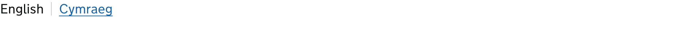

<!-- Generated from src/GovUk.Frontend.AspNetCore.Docs/Templates/components/language-navigation.liquid -->
# Language navigation

[GOV.UK Design System language navigation component](https://design-system.service.gov.uk/components/language-navigation/)


## Tag helpers

### Example


```razor
<govuk-language-navigation>
    <language-navigation-item lang="en">English</language-navigation-item>
    <language-navigation-item lang="cy" href="#" language-description-text="Newid yr iaith i'r Cymraeg">Cymraeg</language-navigation-item>
</govuk-language-navigation>
```


### Example with long tag names


```razor
<govuk-language-navigation>
    <govuk-language-navigation-item lang="en">English</govuk-language-navigation-item>
    <govuk-language-navigation-item lang="cy" href="#" language-description-text="Newid yr iaith i'r Cymraeg">Cymraeg</govuk-language-navigation-item>
</govuk-language-navigation>
```


### API

#### `<govuk-language-navigation>`

| Attribute | Type | Description |
| --- | --- | --- |
| `aria-label` | `string` | The plain text label identifying the landmark to screen readers, written in the language of the current page. Defaults to `Language`. |


#### `<language-navigation-item>` / `<govuk-language-navigation-item>`

The content is the name of the language, written in that language.

Must be inside a `<govuk-language-navigation>` element.

| Attribute | Type | Description |
| --- | --- | --- |
| `current` | `bool?` | Whether this is the language of the current page. Defaults to `true` when no `href` attribute is specified. |
| `dir` | `string` | The text direction of the script the language name is written in. Specify this on every item when the navigation includes scripts written in different directions. |
| `hreflang` | `string` | The language tag for the linked page, added as an `hreflang` attribute for search engines and other machine readers. Defaults to the `lang` attribute. |
| `lang` | `string` | The language tag for the language name, added as a `lang` attribute so that assistive technologies pronounce it correctly. |
| `language-description-text` | `string` | The visually hidden text after the language's link indicating what the link will do. Write this in the language of the link. |
| (link attributes) |  | See [documentation on links](../links.md) for more information. |

