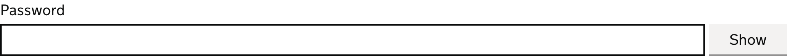

<!-- Generated from src/GovUk.Frontend.AspNetCore.Docs/Templates/components/password-input.liquid -->
# Password input

[GOV.UK Design System password input component](https://design-system.service.gov.uk/components/password-input/)


## Tag helpers

### Example


```razor
<govuk-password-input name="Password">
    <govuk-password-input-label>Password</govuk-password-input-label>
</govuk-password-input>
```


### API

#### `<govuk-password-input>`

| Attribute | Type | Description |
| --- | --- | --- |
| `autocomplete` | `string` | The `autocomplete` attribute for the generated `input` element. |
| `button-class` | `string` | Additional classes for the generated `button` element. |
| `described-by` | `string` | One or more element IDs to add to the `aria-describedby` attribute of the generated `input` element. |
| `disabled` | `bool?` | Whether the `disabled` attribute should be added to the generated `input` element. |
| `for` | `Microsoft.AspNetCore.Mvc.ViewFeatures.ModelExpression` | An expression to be evaluated against the current model. |
| `hide-password-aria-label-text` | `string` | The button text exposed to assistive technologies, like screen readers, when the password is visible. The default is `"Hide password"`. |
| `hide-password-text` | `string` | The button text when the password is visible. The default is `"Hide"`. |
| `id` | `string` | The `id` attribute for the generated `input` element. If not specified then a value is generated from the `name` attribute. |
| `ignore-modelstate-errors` | `bool?` | Whether the `Errors` for the `For` expression should be used to deduce an error message. When there are multiple errors in the `ModelErrorCollection` the first is used. |
| `input-*` |  | Additional attributes to add to the generated `input` element. |
| `label-class` | `string` | Additional classes for the generated `label` element. |
| `name` | `string` | The `name` attribute for the generated `input` element. Required unless `For` is specified. |
| `password-hidden-announcement-text` | `string` | The announcement made to screen reader users when their password has been obscured and is not visible. The default is `"Your password is hidden"`. |
| `password-shown-announcement-text` | `string` | The announcement made to screen reader users when their password has become visible in plain text. The default is `"Your password is visible"`. |
| `readonly` | `bool?` | Whether the `readonly` attribute should be added to the generated `input` element. |
| `show-password-aria-label-text` | `string` | The button text exposed to assistive technologies, like screen readers, when the password is hidden. The default is `"Show password"`. |
| `show-password-text` | `string` | The button text when the password is hidden. The default is `"Show"`. |
| `value` | `string` | The `value` attribute for the generated `input` element. If not specified and `For` is not `null` then the value for the specified model expression will be used. |


#### `<govuk-password-input-label>`

The content is the HTML to use within the component's label.

Must be inside a `<govuk-password-input>` element.

| Attribute | Type | Description |
| --- | --- | --- |
| `is-page-heading` | `bool?` | Whether the label also acts as the heading for the page. |


#### `<govuk-password-input-hint>`

The content is the HTML to use within the component's hint.

Must be inside a `<govuk-password-input>` element.


#### `<govuk-password-input-error-message>`

The content is the HTML to use within the component's error message.

Must be inside a `<govuk-password-input>` element.

| Attribute | Type | Description |
| --- | --- | --- |
| `visually-hidden-text` | `string` | A visually hidden prefix used before the error message. The default is `"Error"`. |


#### `<govuk-password-input-before-input>`

The content is the HTML to use before the generated <input> element.

Must be inside a `<govuk-password-input>` element.


#### `<govuk-password-input-after-input>`

The content is the HTML to use after the generated <input> element.

Must be inside a `<govuk-password-input>` element.

