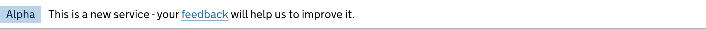

<!-- Generated from src/GovUk.Frontend.AspNetCore.Docs/Templates/components/phase-banner.liquid -->
# GOV.UK phase banner

[GOV.UK Design System GOV.UK phase banner component](https://design-system.service.gov.uk/components/phase-banner/)


### Example


```razor
<govuk-phase-banner>
    <govuk-phase-banner-tag>Alpha</govuk-phase-banner-tag>
    This is a new service - your <a href="#" class="govuk-link">feedback</a> will help us to improve it.
</govuk-phase-banner>
```


### API

#### `<govuk-phase-banner>`

The content is the HTML to use in the phase banner.


#### `<govuk-phase-banner-tag>`

The content is the HTML to use for the tag in the phase banner.

Must be inside a `<govuk-phase-banner>` element.

