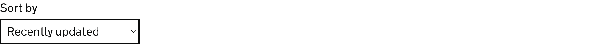

<!-- Generated from src/GovUk.Frontend.AspNetCore.Docs/Templates/components/select.liquid -->
# Select

[GOV.UK Design System select component](https://design-system.service.gov.uk/components/select/)


## Tag helpers

### Example


```razor
<govuk-select for="SortBy">
    <label>Sort by</label>
    <select-item value="published">Recently published</select-item>
    <select-item value="updated">Recently updated</select-item>
    <select-item value="views">Most views</select-item>
    <select-item value="comments">Most comments</select-item>
</govuk-select>
```


### API

#### `<govuk-select>`

| Attribute | Type | Description |
| --- | --- | --- |
| `described-by` | `string` | One or more element IDs to add to the `aria-describedby` attribute of the generated `select` element. |
| `disabled` | `bool?` | Whether the `disabled` attribute should be added to the generated `select` element. |
| `for` | `Microsoft.AspNetCore.Mvc.ViewFeatures.ModelExpression` | An expression to be evaluated against the current model. |
| `id` | `string` | The `id` attribute for the generated `select` element. If not specified then a value is generated from the `name` attribute. |
| `ignore-modelstate-errors` | `bool?` | Whether the `Errors` for the `For` expression should be used to deduce an error message. When there are multiple errors in the `ModelErrorCollection` the first is used. |
| `label-class` | `string` | Additional classes for the generated `label` element. |
| `name` | `string` | The `name` attribute for the generated `select` element. Required unless `For` is specified. |
| `select-*` |  | Additional attributes to add to the generated `select` element. |


#### `<label>` / `<govuk-select-label>`

The content is the HTML to use within the component's label.

Must be inside a `<govuk-select>` element.

| Attribute | Type | Description |
| --- | --- | --- |
| `is-page-heading` | `bool?` | Whether the label also acts as the heading for the page. |


#### `<hint>` / `<govuk-select-hint>`

The content is the HTML to use within the component's hint.

Must be inside a `<govuk-select>` element.


#### `<error-message>` / `<govuk-select-error-message>`

The content is the HTML to use within the component's error message.

Must be inside a `<govuk-select>` element.

| Attribute | Type | Description |
| --- | --- | --- |
| `visually-hidden-text` | `string` | A visually hidden prefix used before the error message. The default is `"Error"`. |


#### `<before-input>` / `<govuk-select-before-input>`

The content is the HTML to use before the generated select element.

Must be inside a `<govuk-select>` element.


#### `<after-input>` / `<govuk-select-after-input>`

The content is the HTML to use after the generated select element.

Must be inside a `<govuk-select>` element.


#### `<select-item>` / `<govuk-select-item>`

The content is the HTML to use within the generated option element.

Must be inside a `<govuk-select>` element.

| Attribute | Type | Description |
| --- | --- | --- |
| `disabled` | `bool?` | Whether the `disabled` attribute should be added to the generated `option` element. |
| `selected` | `bool?` | Whether the item should be selected. If not specified and `For` is not `null` on the parent `SelectTagHelper` then this value will be computed by comparing the `Value` attribute with the model expression's value. |
| `value` | `string` | The `value` attribute for the item. |

