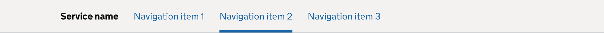

<!-- Generated from src/GovUk.Frontend.AspNetCore.Docs/Templates/components/service-navigation.liquid -->
# Service navigation

[GOV.UK Design System service navigation component](https://design-system.service.gov.uk/components/service-navigation/)


## Tag helpers

### Example



```razor
<govuk-service-navigation service-name="Service name" service-url="#">
    <govuk-service-navigation-nav>
        <govuk-service-navigation-nav-item href="#">Navigation item 1</govuk-service-navigation-nav-item>
        <govuk-service-navigation-nav-item href="#" active="true">Navigation item 2</govuk-service-navigation-nav-item>
        <govuk-service-navigation-nav-item href="#">Navigation item 3</govuk-service-navigation-nav-item>
    </govuk-service-navigation-nav>
</govuk-service-navigation>
```


### API

#### `<govuk-service-navigation>`

| Attribute | Type | Description |
| --- | --- | --- |
| `service-name` | `string` | The name of your service. |
| `service-url` | `string` | The homepage of your service. |


#### `<govuk-service-navigation-start>`

The content is the HTML at the start of the service header container.

Must be inside a `<govuk-service-navigation>` element.


#### `<govuk-service-navigation-nav>`

Must be inside a `<govuk-service-navigation>` element.

| Attribute | Type | Description |
| --- | --- | --- |
| `aria-label` | `string` | The text for the `aria-label` which labels the service navigation container when a service name is included. If not specified, "Service information" will be used. |
| `id` | `string` | The ID used to associate the mobile navigation toggle with the navigation menu. If not specified, `navigation` will be used. |
| `label` | `string` | The screen reader label for the mobile navigation menu. If not specified, the value of the `menu-button-text` attribute will be used. |
| `menu-button-label` | `string` | The screen reader label for the mobile navigation menu toggle. If not specified, the value of the `menu-button-text` attribute will be used. |
| `menu-button-text` | `string` | The text of the mobile navigation menu toggle. |


#### `<govuk-service-navigation-nav-start>`

The content is the HTML before the first list item in the navigation list.

Must be inside a `<govuk-service-navigation-nav>` element.


#### `<govuk-service-navigation-nav-item>`

The content is the HTML to use within the generated service navigation item.

Must be inside a `<govuk-service-navigation-nav>` element.

| Attribute | Type | Description |
| --- | --- | --- |
| `active` | `bool?` | Whether the user is within this group of pages in the navigation hierarchy. |
| `current` | `bool?` | Whether the user is currently on this page. This takes precedence over the `active` attribute. |
| (link attributes) |  | See [documentation on links](../links.md) for more information. |


#### `<govuk-service-navigation-nav-end>`

The content is the HTML after the last list item in the navigation list.

Must be inside a `<govuk-service-navigation-nav>` element.


#### `<govuk-service-navigation-end>`

The content is the HTML at the end of the service header container.

Must be inside a `<govuk-service-navigation>` element.

