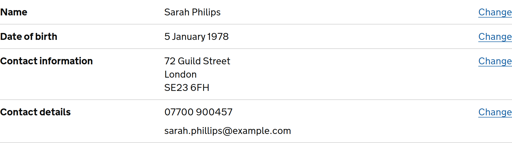
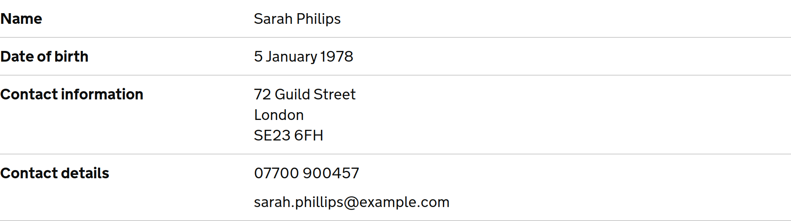
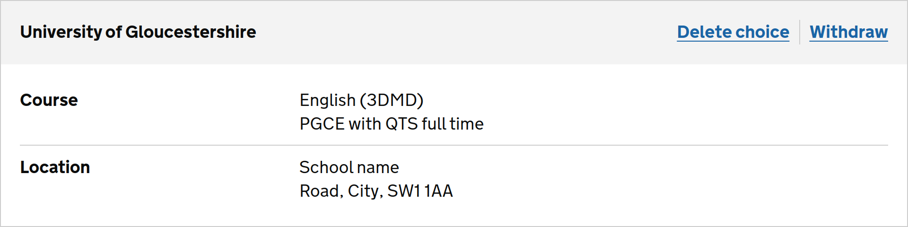

<!-- Generated from src/GovUk.Frontend.AspNetCore.Docs/Templates/components/summary-list.liquid -->
# Summary list

[GOV.UK Design System summary list component](https://design-system.service.gov.uk/components/summary-list/)


## Tag helpers

### Example with actions


```razor
<govuk-summary-list>
    <row>
        <key>Name</key>
        <value>Sarah Philips</value>
        <row-actions>
            <action href="#" visually-hidden-text="name">Change</action>
        </row-actions>
    </row>
    <row>
        <key>Date of birth</key>
        <value>5 January 1978</value>
        <row-actions>
            <action href="#" visually-hidden-text="date of birth">Change</action>
        </row-actions>
    </row>
    <row>
        <key>Contact information</key>
        <value>72 Guild Street<br />London<br />SE23 6FH</value>
        <row-actions>
            <action href="#" visually-hidden-text="contact information">Change</action>
        </row-actions>
    </row>
    <row>
        <key>Contact details</key>
        <value>
            <p class="govuk-body">07700 900457</p><p class="govuk-body">sarah.phillips@example.com</p>
        </value>
        <row-actions>
            <action href="#" visually-hidden-text="contact details">Change</action>
        </row-actions>
    </row>
</govuk-summary-list>
```


### Example without actions


```razor
<govuk-summary-list>
    <row>
        <key>Name</key>
        <value>Sarah Philips</value>
    </row>
    <row>
        <key>Date of birth</key>
        <value>5 January 1978</value>
    </row>
    <row>
        <key>Contact information</key>
        <value>72 Guild Street<br />London<br />SE23 6FH</value>
    </row>
    <row>
        <key>Contact details</key>
        <value><p class="govuk-body">07700 900457</p><p class="govuk-body">sarah.phillips@example.com</p></value>
    </row>
</govuk-summary-list>
```


### Example with card


```razor
<govuk-summary-card>
    <title>University of Gloucestershire</title>
    <card-actions>
        <action href="#" visually-hidden-text="of University of Gloucestershire">Delete choice</action>
        <action href="#" visually-hidden-text="from University of Gloucestershire">Withdraw</action>
    </card-actions>
    <govuk-summary-list>
        <row>
            <key>Course</key>
            <value>English (3DMD)<br />PGCE with QTS full time</value>
        </row>
        <row>
            <key>Location</key>
            <value>School name<br />Road, City, SW1 1AA</value>
        </row>
    </govuk-summary-list>
</govuk-summary-card>
```


### API

#### `<govuk-summary-list>`


#### `<govuk-summary-list-row>`

Must be inside a `<govuk-summary-list>` element.


#### `<govuk-summary-list-row-key>`

Must be inside a `<govuk-summary-list-row>` or `<row>` element.


#### `<govuk-summary-list-row-value>`

Must be inside a `<govuk-summary-list-row>` or `<row>` element.


#### `<govuk-summary-list-row-actions>`

Must be inside a `<govuk-summary-list-row>` or `<row>` element.


#### `<govuk-summary-list-row-action>`

Must be inside a `<govuk-summary-list-row-actions>` or `<row-actions>` element.

| Attribute | Type | Description |
| --- | --- | --- |
| `visually-hidden-text` | `string` | The visually hidden text for the action link. |
| (link attributes) |  | See [documentation on links](../links.md) for more information. |


#### `<govuk-summary-card>`


#### `<govuk-summary-card-title>`

Must be inside a `<govuk-summary-card>` element.

| Attribute | Type | Description |
| --- | --- | --- |
| `heading-level` | `System.Int32?` | The heading level. Must be between `1` and `6` (inclusive). The default is `2`. |


#### `<govuk-summary-card-actions>`

Must be inside a `<govuk-summary-card>` element.


#### `<govuk-summary-card-action>`

Must be inside a `<govuk-summary-card-actions>` or `<card-actions>` element.

| Attribute | Type | Description |
| --- | --- | --- |
| `visually-hidden-text` | `string` | The visually hidden text for the action link. |
| (link attributes) |  | See [documentation on links](../links.md) for more information. |

