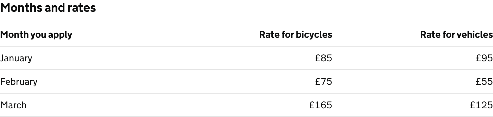
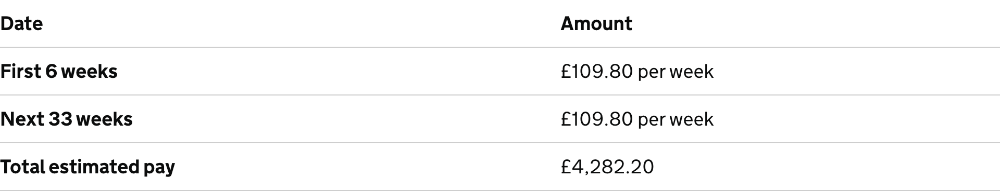
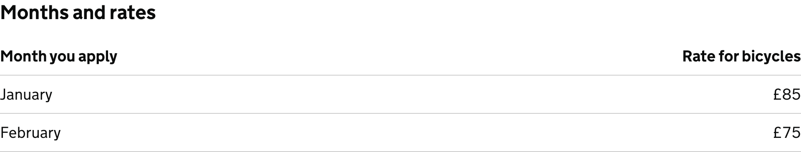

<!-- Generated from src/GovUk.Frontend.AspNetCore.Docs/Templates/components/table.liquid -->
# Table

[GOV.UK Design System table component](https://design-system.service.gov.uk/components/table/)


## Tag helpers

### Example


```razor
<govuk-table>
    <table-caption class="govuk-table__caption--m">Months and rates</table-caption>
    <table-head>
        <table-head-cell>Month you apply</table-head-cell>
        <table-head-cell format="numeric">Rate for bicycles</table-head-cell>
        <table-head-cell format="numeric">Rate for vehicles</table-head-cell>
    </table-head>
    <table-row>
        <table-cell>January</table-cell>
        <table-cell format="numeric">£85</table-cell>
        <table-cell format="numeric">£95</table-cell>
    </table-row>
    <table-row>
        <table-cell>February</table-cell>
        <table-cell format="numeric">£75</table-cell>
        <table-cell format="numeric">£55</table-cell>
    </table-row>
    <table-row>
        <table-cell>March</table-cell>
        <table-cell format="numeric">£165</table-cell>
        <table-cell format="numeric">£125</table-cell>
    </table-row>
</govuk-table>
```


### Example with the first cell as a header


```razor
<govuk-table first-cell-is-header="true">
    <table-head>
        <table-head-cell>Date</table-head-cell>
        <table-head-cell>Amount</table-head-cell>
    </table-head>
    <table-row>
        <table-cell>First 6 weeks</table-cell>
        <table-cell>£109.80 per week</table-cell>
    </table-row>
    <table-row>
        <table-cell>Next 33 weeks</table-cell>
        <table-cell>£109.80 per week</table-cell>
    </table-row>
    <table-row>
        <table-cell>Total estimated pay</table-cell>
        <table-cell>£4,282.20</table-cell>
    </table-row>
</govuk-table>
```


### Example with long tag names


```razor
<govuk-table>
    <govuk-table-caption class="govuk-table__caption--m">Months and rates</govuk-table-caption>
    <govuk-table-head>
        <govuk-table-head-cell>Month you apply</govuk-table-head-cell>
        <govuk-table-head-cell format="numeric">Rate for bicycles</govuk-table-head-cell>
    </govuk-table-head>
    <govuk-table-row>
        <govuk-table-cell>January</govuk-table-cell>
        <govuk-table-cell format="numeric">£85</govuk-table-cell>
    </govuk-table-row>
    <govuk-table-row>
        <govuk-table-cell>February</govuk-table-cell>
        <govuk-table-cell format="numeric">£75</govuk-table-cell>
    </govuk-table-row>
</govuk-table>
```


### API

#### `<govuk-table>`

| Attribute | Type | Description |
| --- | --- | --- |
| `first-cell-is-header` | `bool?` | Whether the first cell in each row is a header cell. The default is `false`. |


#### `<table-caption>` / `<govuk-table-caption>`

The content is the HTML to use within the table caption.

Must be inside a `<govuk-table>` element.


#### `<table-head>` / `<govuk-table-head>`

Must be inside a `<govuk-table>` element.


#### `<table-head-cell>` / `<govuk-table-head-cell>`

The content is the HTML to use within the table head cell.

Must be inside a `<table-head>` or `<govuk-table-head>` element.

| Attribute | Type | Description |
| --- | --- | --- |
| `colspan` | `int?` | The number of columns the cell spans. |
| `format` | `string` | The format of the cell's content. Specify `numeric` to right align the content. |
| `rowspan` | `int?` | The number of rows the cell spans. |


#### `<table-row>` / `<govuk-table-row>`

Must be inside a `<govuk-table>` element.


#### `<table-cell>` / `<govuk-table-cell>`

The content is the HTML to use within the table cell.

Must be inside a `<table-row>` or `<govuk-table-row>` element.

| Attribute | Type | Description |
| --- | --- | --- |
| `colspan` | `int?` | The number of columns the cell spans. |
| `format` | `string` | The format of the cell's content. Specify `numeric` to right align the content. Ignored when the cell is the first in its row and the table has `first-cell-is-header` specified. |
| `rowspan` | `int?` | The number of rows the cell spans. |

