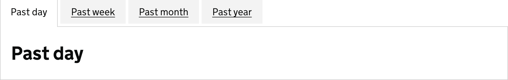

<!-- Generated from src/GovUk.Frontend.AspNetCore.Docs/Templates/components/tabs.liquid -->
# Tabs

[GOV.UK Design System tabs component](https://design-system.service.gov.uk/components/tabs/)


## Tag helpers

### Example


```razor
<govuk-tabs>
    <tabs-item id="past-day" label="Past day">
        <h2 class="govuk-heading-l">Past day</h2>
    </tabs-item>
    <tabs-item id="past-week" label="Past week">
        <h2 class="govuk-heading-l">Past week</h2>
    </tabs-item>
    <tabs-item id="past-month" label="Past month">
        <h2 class="govuk-heading-l">Past month</h2>
    </tabs-item>
    <tabs-item id="past-year" label="Past year">
        <h2 class="govuk-heading-l">Past year</h2>
    </tabs-item>
</govuk-tabs>
```


### Example with long tag names


```razor
<govuk-tabs>
    <govuk-tabs-item id="past-day" label="Past day">
        <h2 class="govuk-heading-l">Past day</h2>
    </govuk-tabs-item>
    <govuk-tabs-item id="past-week" label="Past week">
        <h2 class="govuk-heading-l">Past week</h2>
    </govuk-tabs-item>
    <govuk-tabs-item id="past-month" label="Past month">
        <h2 class="govuk-heading-l">Past month</h2>
    </govuk-tabs-item>
    <govuk-tabs-item id="past-year" label="Past year">
        <h2 class="govuk-heading-l">Past year</h2>
    </govuk-tabs-item>
</govuk-tabs>
```


### API

#### `<govuk-tabs>`

| Attribute | Type | Description |
| --- | --- | --- |
| `id` | `string` | The `id` attribute for the main tabs component. |
| `id-prefix` | `string` | The prefix to use when generating IDs for the items. Required unless every item specifies the `Id`. |
| `title` | `string` | The title for the tabs table of contents. The default is 'Contents'. |


#### `<tabs-item>` / `<govuk-tabs-item>`

The content is the HTML of the panel.

Must be inside a `<govuk-tabs>` element.

| Attribute | Type | Description |
| --- | --- | --- |
| `id` | `string` | The `id` attribute for the tab. Required unless `IdPrefix` is specified on the parent `TabsTagHelper`. |
| `label` | `string` | The text label of the tab. |
| `link-*` |  | Additional attributes to add to the generated link to this tab. |

