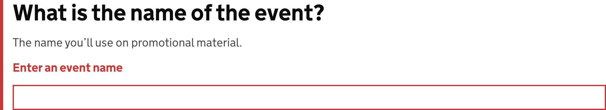

<!-- Generated from src/GovUk.Frontend.AspNetCore.Docs/Templates/components/text-input.liquid -->
# Text input

[GOV.UK Design System text input component](https://design-system.service.gov.uk/components/text-input/)


## Tag helpers

### Example


```razor
<govuk-input for="AccountNumber" input-class="govuk-input--width-10" inputmode="numeric" pattern="[0-9]*" spellcheck="false">
    <govuk-input-label is-page-heading="true" class="govuk-label--l">What is your account number?</govuk-input-label>
    <govuk-input-hint>Must be between 6 and 8 digits long</govuk-input-hint>
</govuk-input>
```


### Example with error message


```razor
<govuk-input name="EventName">
    <govuk-input-label is-page-heading="true" class="govuk-label--l">What is the name of the event?</govuk-input-label>
    <govuk-input-hint>The name you’ll use on promotional material.</govuk-input-hint>
    <govuk-input-error-message>Enter an event name</govuk-input-error-message>
</govuk-input>
```


### Example with prefix and suffix


```razor
<govuk-input for="CostPerItem" input-class="govuk-input--width-5" spellcheck="false">
    <govuk-input-label is-page-heading="true" class="govuk-label--l">What is the cost per item, in pounds?</govuk-input-label>
    <govuk-input-prefix>&pound;</govuk-input-prefix>
    <govuk-input-suffix>per item</govuk-input-suffix>
</govuk-input>
```


### API

#### `<govuk-input>`

| Attribute | Type | Description |
| --- | --- | --- |
| `autocapitalize` | `string` | The `autocapitalize` attribute for the generated `input` element. |
| `autocomplete` | `string` | The `autocomplete` attribute for the generated `input` element. |
| `described-by` | `string` | One or more element IDs to add to the `aria-describedby` attribute of the generated `input` element. |
| `disabled` | `bool?` | Whether the `disabled` attribute should be added to the generated `input` element. |
| `for` | `Microsoft.AspNetCore.Mvc.ViewFeatures.ModelExpression` | An expression to be evaluated against the current model. |
| `id` | `string` | The `id` attribute for the generated `input` element. If not specified then a value is generated from the `name` attribute. |
| `ignore-modelstate-errors` | `bool?` | Whether the `Errors` for the `For` expression should be used to deduce an error message. When there are multiple errors in the `ModelErrorCollection` the first is used. |
| `input-*` |  | Additional attributes to add to the generated `input` element. |
| `input-wrapper-*` |  | Additional attributes to add to the element that wraps the `input` element. |
| `inputmode` | `string` | The `inputmode` attribute for the generated `input` element. |
| `label-class` | `string` | Additional classes for the generated `label` element. |
| `name` | `string` | The `name` attribute for the generated `input` element. Required unless `For` is specified. |
| `pattern` | `string` | The `pattern` attribute for the generated `input` element. |
| `readonly` | `bool?` | Whether the `readonly` attribute should be added to the generated `input` element. |
| `spellcheck` | `bool?` | The `spellcheck` attribute for the generated `input` element. |
| `type` | `string` | The `type` attribute for the generated `input` element. The default is `"text"`. |
| `value` | `string` | The `value` attribute for the generated `input` element. If not specified and `For` is not `null` then the value for the specified model expression will be used. |


#### `<govuk-input-label>`

The content is the HTML to use within the component's label.

Must be inside a `<govuk-input>` element.

| Attribute | Type | Description |
| --- | --- | --- |
| `is-page-heading` | `bool?` | Whether the label also acts as the heading for the page. |


#### `<govuk-input-hint>`

The content is the HTML to use within the component's hint.

Must be inside a `<govuk-input>` element.


#### `<govuk-input-error-message>`

The content is the HTML to use within the component's error message.

Must be inside a `<govuk-input>` element.

| Attribute | Type | Description |
| --- | --- | --- |
| `visually-hidden-text` | `string` | A visually hidden prefix used before the error message. The default is `"Error"`. |


#### `<govuk-input-before-input>`

The content is the HTML to use before the generated input element.

Must be inside a `<govuk-input>` element.


#### `<govuk-input-prefix>`

The content is the HTML to use within the component's prefix.

Must be inside a `<govuk-input>` element.


#### `<govuk-input-suffix>`

The content is the HTML to use within the component's suffix.

Must be inside a `<govuk-input>` element.


#### `<govuk-input-after-input>`

The content is the HTML to use after the generated input element.

Must be inside a `<govuk-input>` element.

