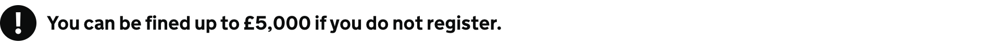

<!-- Generated from src/GovUk.Frontend.AspNetCore.Docs/Templates/components/warning-text.liquid -->
# Warning text

[GOV.UK Design System warning text component](https://design-system.service.gov.uk/components/warning-text/)


## Tag helpers

### Example


```razor
<govuk-warning-text icon-fallback-text="Warning">
    You can be fined up to £5,000 if you do not register.
</govuk-warning-text>
```


### API

#### `<govuk-warning-text>`

The content is the HTML to use within the warning text.

| Attribute | Type | Description |
| --- | --- | --- |
| `icon-fallback-text` | `string` | The fallback text for the icon. |

